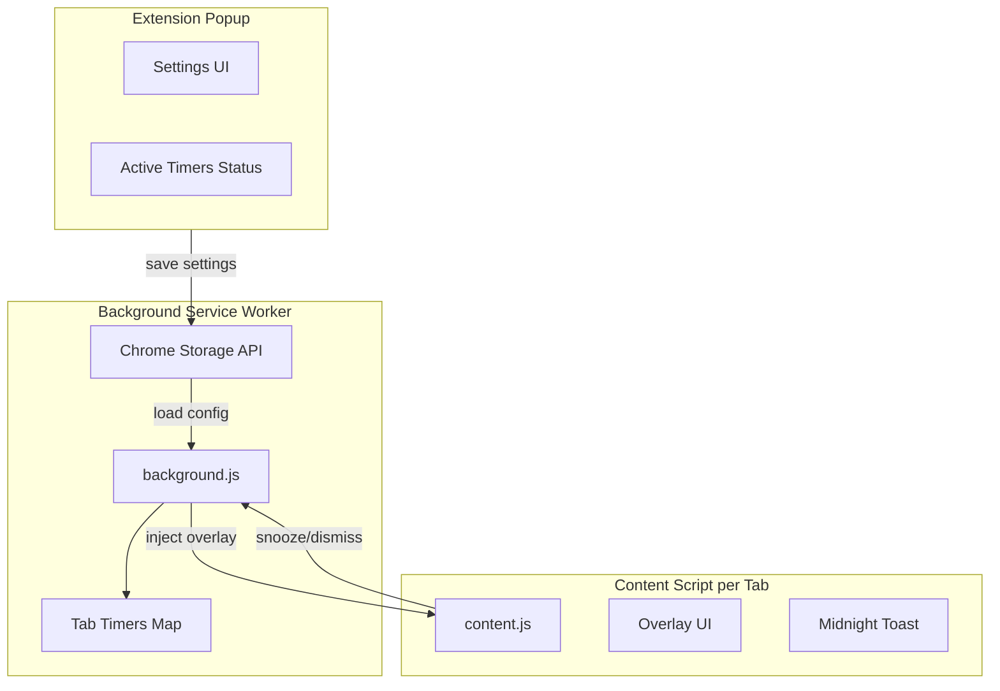
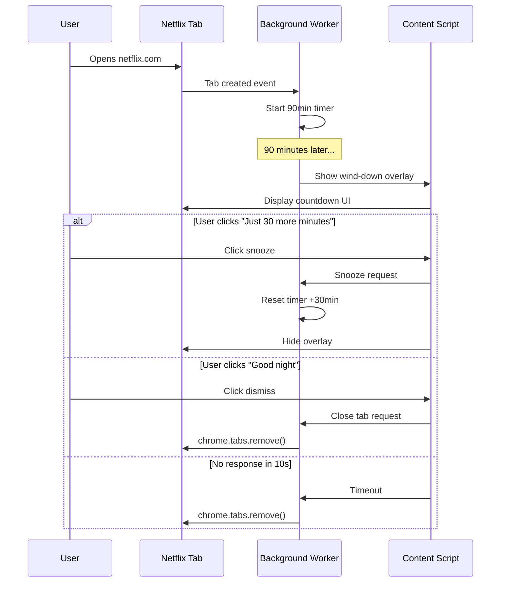

# Take a Break - Chrome Extension Plan

A friendly Chrome extension that helps you get better sleep by gently reminding you to stop binge-watching late at night.

---

## Naming and Tone

**Extension Name**: "Take a Break" or "Bedtime Guardian"

**Wording Philosophy**:

- Instead of "kill/stop tab" → "Wind down your show" or "Time to rest"
- Instead of "Alert" → "Gentle reminder"
- Snooze button → "Just 30 more minutes..." or "One more episode"
- Midnight reminder → "It's past your bedtime!"

---

## Core Features

### 1. Auto Wind-Down Timer

When a user opens a streaming site, a background timer starts. After the configured duration (default: 90 minutes), the extension shows a friendly overlay.

**Countdown Overlay** (5-10 seconds configurable):

- Full-screen overlay on the tab
- Shows countdown: "Winding down in 8... 7... 6..."
- Two buttons:
  - "I'm still watching" (snooze - adds 30 mins by default)
  - "Good night!" (closes tab gracefully)
- If no action taken → tab closes automatically

### 2. Midnight Reminder Mode

After midnight (configurable), shows a non-intrusive toast notification:

- "Hey night owl! It's past midnight. Maybe time for bed?"
- Dismiss button only (no auto-close)
- Shows once per session per site

### 3. Configurable Settings

| Setting | Default | Description |

|---------|---------|-------------|

| Watch Timer | 90 minutes | Time before wind-down kicks in |

| Countdown Duration | 10 seconds | Warning countdown before closing |

| Snooze Duration | 30 minutes | Extra time when user clicks snooze |

| Bedtime Hour | 12:00 AM (midnight) | When midnight reminder activates |

| Websites | See below | List of streaming sites to monitor |

**Default Website List**:

*Global:*

- netflix.com
- primevideo.com / amazon.com/gp/video
- disneyplus.com
- hulu.com
- hbomax.com / max.com
- youtube.com
- peacocktv.com
- paramountplus.com
- crunchyroll.com
- appletv.apple.com

*India:*

- hotstar.com (Disney+ Hotstar)
- jiocinema.com
- sonyliv.com
- zee5.com
- voot.com
- mxplayer.in
- altbalaji.com
- erosnow.com
- sunnxt.com
- hoichoi.tv (Bengali)
- aha.video (Telugu/Tamil)
- chaupal.tv (Punjabi/Haryanvi)
- shemaroome.com

---

## Architecture



---

## File Structure

```
take-a-break/
├── manifest.json           # Extension manifest v3
├── background.js           # Service worker - timer logic
├── content.js              # Injected into streaming sites
├── popup/
│   ├── popup.html          # Settings popup UI
│   ├── popup.css           # Popup styles
│   └── popup.js            # Popup logic
├── styles/
│   └── overlay.css         # Wind-down overlay styles
├── icons/
│   ├── icon16.png
│   ├── icon48.png
│   └── icon128.png
└── README.md
```

---

## Implementation Details

### manifest.json

- Manifest V3 (required for modern Chrome extensions)
- Permissions: `storage`, `tabs`, `alarms`
- Host permissions for streaming sites
- Content scripts auto-injected on matching URLs

### background.js (Service Worker)

- Maintains a Map of `tabId → {startTime, snoozedUntil, notifiedMidnight}`
- Uses `chrome.alarms` API for reliable timing
- Listens for tab updates/closes to manage timers
- Sends messages to content scripts to show/hide overlays

### content.js

- Receives messages from background to show UI
- Injects overlay DOM when wind-down triggered
- Handles button clicks, sends snooze/dismiss back to background
- Checks time for midnight reminder on page load

### Overlay UI Design

- Semi-transparent dark backdrop (respects the viewing mood)
- Centered card with:
  - Friendly message + moon/sleep icon
  - Large countdown number
  - Two action buttons (styled nicely, not generic)
- Smooth fade-in animation
- Accessible (keyboard navigation, screen reader friendly)

---

## User Flow



---

## Popup Settings UI

Clean, minimal settings page:

1. **Timer Settings**

   - Watch duration slider (30min - 4hrs, default 90min)
   - Countdown slider (5-30 seconds, default 10s)
   - Snooze duration slider (15min - 1hr, default 30min)

2. **Bedtime Mode**

   - Toggle: Enable midnight reminder
   - Time picker: Set your bedtime (default midnight)

3. **Websites**

   - Checklist of default sites (toggle each)
   - Text input to add custom sites
   - Remove button for custom sites

4. **Quick Actions**

   - "Pause for tonight" toggle (disables for current session)
   - Current status indicator (watching X site for Y minutes)

---

## Nice UI Touches

- Use a calming color palette (deep blues, soft purples, warm yellows for accents)
- Moon and stars iconography
- Playful copy:
  - "Time flies when you're binging!"
  - "Your bed misses you"
  - "Tomorrow-you will thank you"
- Subtle animations (breathing glow on countdown, gentle fade transitions)
- Sound option: soft chime when reminder appears (disabled by default)

---

## Technical Considerations

1. **Timer Persistence**: Use `chrome.storage.local` to persist timer state across browser restarts
2. **Multiple Tabs**: Each streaming tab has its own timer
3. **Tab Navigation**: If user navigates away from streaming site, pause/clear timer
4. **Incognito**: Works in incognito if user enables it in extension settings
5. **Performance**: Minimal CPU usage - uses alarm API, not setInterval

---

## Future Enhancements (Out of Scope for V1)

- Statistics dashboard (hours saved, streaks)
- Sync settings across devices
- Scheduled "do not disturb" windows
- Integration with sleep tracking apps